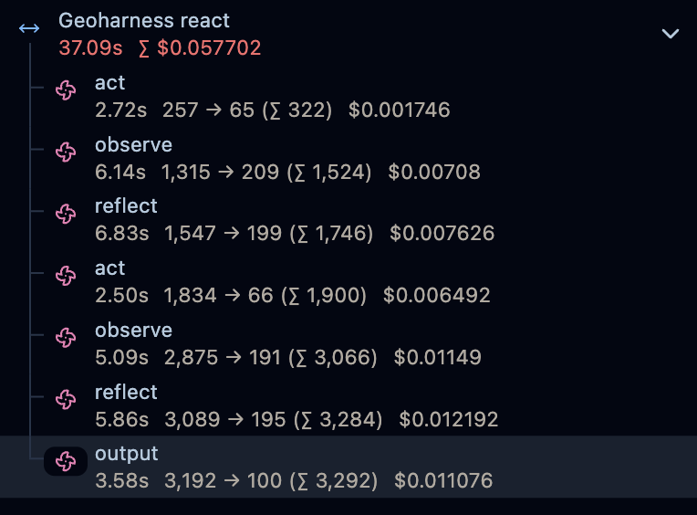

# Geoharness

A minimal ReAct agent built in pure Python for geospatial tasks — currently focused on solar siting. No frameworks, no graph traversals, no abstractions beyond what the task requires.

**Live demo:** [Here](https://dwom83i5hpgfm.cloudfront.net) — eval results with full agent reasoning traces

A few overarching goals:
- Understand how basic/unengineered an agent architecture can be whilst still being performant (no strict graph traversals or large tool sets)
- How well a different modality of data (geospatial) can be handled by LLMs — can an agent answer geospatial questions and understand the context
- Build a local MCP server for the agent's tools to evaluate the drawbacks and benefits of MCP in practice from the ground up

Example target question: *Is this a good coordinate to place solar panels?*

## Motivation

Commercial AI products I have built have used a graph-based architecture in the quest for robustness and repeatability, using a large set of tools and planners for predictable tool calling.

As graph-based products grow, I feel that the maintenance overhead of the graph, the increasing difficulty of extensibility and the brittleness of tasks which fail prescribed traversal started to become less worth it — especially as these architectures seemed to constrain the power afforded by newly released models.

The alternative — fewer, more primitive tools with stronger models — is worth testing properly. I wanted to use a basic ReAct structure with very few tools to evaluate how well a simple agent architecture can accomplish complex tasks. Geospatial data seemed relatively complex as a test bed. The pure Python stipulation is a bit of extra fun, and useful for understanding how popular frameworks abstract away agent architecture.

## Architecture

A single ReAct loop (`act → observe → reflect`) with a small set of primitive tools. The agent calls tools in parallel where independent, reflects on its own progress, and commits to a structured verdict at the final output step.

**Tools**

| Tool | Source | What it returns |
|---|---|---|
| `get_climate_data` | [NASA POWER](https://power.larc.nasa.gov/) | Monthly solar irradiance and temperature averages for a coordinate |
| `get_terrain_data` | [OpenTopography](https://opentopography.org/) (SRTM GL1 / COP30) | Elevation, slope, and aspect for a ~1km radius around a coordinate |
| `web_search` | DuckDuckGo | Broad web search (excluded from eval runs) |
| `web_fetch` | HTTP scrape | Full text of a specific URL |

**Key implementation decisions**
- Parallel tool calls — climate and terrain data are fetched concurrently via `ThreadPoolExecutor`, halving tool-call latency
- Structured output on the final step only — `output_config` with JSON schema is scoped to `agent.output()` only; `act`, `observe`, and `reflect` use plain text formats that the parser depends on
- Disk cache for all tool calls — terrain data is static, climate data is highly cacheable; round-trip to external APIs only happens on cache miss
- Tool error detection — errors from OpenTopography or NASA POWER are flagged in eval results without crashing the run

## MCP server

The geospatial tools are exposed as an MCP server via [FastMCP](https://github.com/jlowin/fastmcp), making them available to any MCP-compatible client including Claude Code.

```bash
# stdio (Claude Code integration — starts automatically via .claude/settings.json)
uv run geo_mcp.py

# HTTP (for eval or external clients)
uv run geo_mcp.py --http
```

To use with Claude Code, the server is configured in `.claude/settings.json` and starts automatically when you open the project. You can then ask Claude Code directly: *"Is Seville a good location for solar panels?"* and it will call the tools natively.

**MCP eval finding:** running the 11-location eval via the MCP path (tools called through the protocol rather than directly) produced the same 10/11 score with the same failure. This confirms the quality is in the tool data, not the custom ReAct prompt tuning.

## Eval

A hand-labelled eval set of 11 locations tests whether the agent reaches the correct GOOD / MARGINAL / BAD verdict from raw geospatial data alone. Current score: **10/11 (91%)**.

Scoring rules are documented in [`eval/solar/eval_rules.md`](eval/solar/eval_rules.md). Locations cover a spread of latitudes, hemispheres, and failure modes (low irradiance, high cloud cover, bad aspect, steep slope). `web_search` is excluded — the agent must reason from tool data alone, not training knowledge.

The one remaining failure (Croatian Coast, 4.3 kWh/m²/day) is a legitimate borderline case. The eval rules are intentionally not softened to match the agent output.

```bash
# standard eval
uv run eval/solar/eval.py

# eval via MCP server
uv run eval/solar/eval.py --mcp
```

Results are saved to `eval/solar/results/` with a UTC timestamp per run and include the full Langfuse trace ID for each case.

## Running locally

1. Copy `.env.example` to `.env` and fill in your credentials
2. `uv sync` to install dependencies
3. `uv run main.py "[your query here]"`

**Required environment variables:**
```
ANTHROPIC_KEY=
LANGFUSE_PUBLIC_KEY=
LANGFUSE_SECRET_KEY=
LANGFUSE_HOST=https://cloud.langfuse.com
OPENTOPOGRAPHY_API_KEY=
```

## Observability

Each agent run is traced end-to-end using [Langfuse](https://langfuse.com). The full loop appears as a single trace named `Geoharness react`, with each LLM call (`act`, `observe`, `reflect`, `output`) as a labelled child generation — useful for inspecting prompt inputs, model outputs, and token usage at each step.



## Frontend

A static frontend displays the eval results with the full agent reasoning trace per location. Built with vanilla HTML/JS — no framework, no build step.

```bash
# develop locally
cd frontend && python3 -m http.server 3000
```

